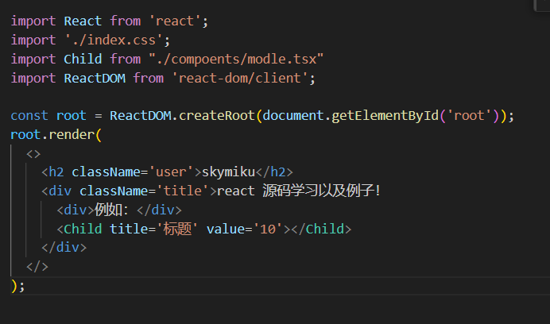
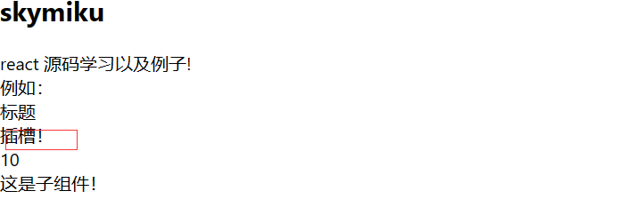

# 组件渲染
组件渲染与之前写的一致
都是先创建一个将虚拟dom 通过render函数将虚拟dom 通过creatElement转化为真实dom。
<!-- more -->

# 组件中的prop
函数组件中，渲染时，父组件调用子组件函数，将属性值装入prop,作为一个只读属性传入。

例如在src中新建一个componets文件夹，modle组件引入index.js



```
import React from 'react';
import './index.css';
import Child from "./compoents/modle.tsx"
import ReactDOM from 'react-dom/client';

const root = ReactDOM.createRoot(document.getElementById('root'));
root.render(
  <>
    <h2 className='user'>skymiku</h2>
    <div className='title'>react 源码学习以及例子!
      <div>例如：</div>
      <Child title='标题' value='10'></Child>
    </div>
  </>
);

```

如果在子组件中直接修改属性，页面将会报错。

```
import React from 'react'

const Child = (prop) => {
    //  Cannot assign to read only property 'title' of object '#<Object>
    // prop.title = '标题修改'
    console.log(Object.isFrozen(prop)); //冻结了！
    return (
        <div>
            <div>{prop.title}</div>
            <div>{prop.value}</div>
            这是子组件！
        </div>
    )
}
export default Child
```
根据Object.isFrozen(),看到prop对象是被冻结了。所以不能执行修改新增删除等操作。

# 组件插槽

创建虚拟Dom的时候，父组件将children作为子节点传入组件

父组件:

```
 <Child title='标题' value='10'>
        <div>插槽！</div>
 </Child>
```

子组件

```
   return (
        <div>
            <div>{prop.title}</div>
            <div>
                {prop.children}
            </div>
            <div>{prop.value}</div>
            这是子组件！
        </div>
    )
```



在React中如果像是vue一样，实现一个具名插槽。
可以通过传入属性 如同 solt="top"之类的，在子组件中prop.children,判断名称后自定义显示组件或者调整显示内容。

